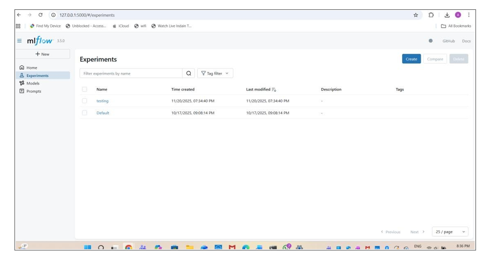
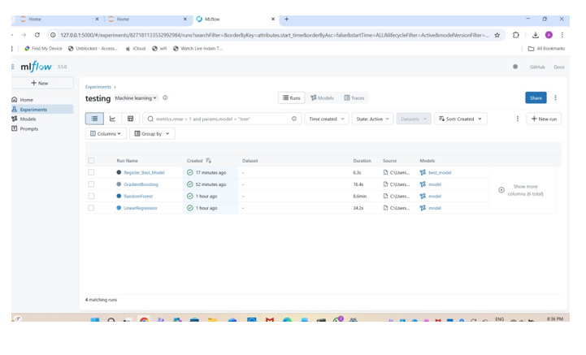
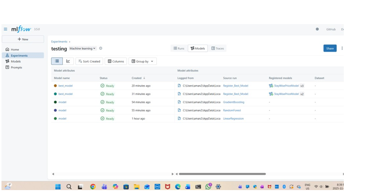
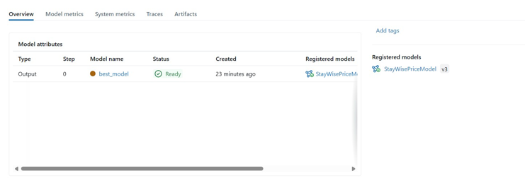
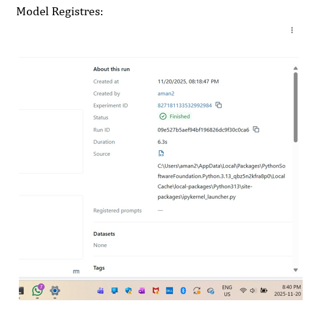

# Predicting Airbnb Listing Prices with MLflow and AWS S3

## Project Overview

This project predicts optimal nightly prices for Airbnb listings on
StayWise, a global vacation rental platform. Accurate price prediction
helps hosts set competitive rates and improves booking efficiency. The
project uses:

-   **AWS S3**: Data storage
-   **MLflow**: Experiment tracking and model registry
-   **Machine Learning Models**: Regression models for price prediction

## Objectives

-   Retrieve Airbnb listings from AWS S3
-   Clean and preprocess the data
-   Develop and compare multiple regression models
-   Track experiments and register the best model in MLflow

## Dataset Description

The dataset contains information about Airbnb listings, including price,
location, amenities, reviews, and host details. The dataset requires
preprocessing to handle missing values, categorical variables, and
outliers.

### Data Preprocessing

-   Handled missing values in `name` and `host_name`
-   Converted categorical variables using encoding
-   Created new features like `amenities_count`
-   Removed outliers using the IQR method
-   Split the dataset into training and testing sets

## MLflow Experiment Tracking

All models were tracked using MLflow, logging metrics, parameters, and
artifacts. The best model (Random Forest) was registered in the MLflow
Model Registry.

## Repository Structure

    ML-flow-experiments/
    ├── notebook.py
    ├── requirements.txt
    ├── .gitignore
    ├── README.md

## Setup Instructions

### 1. Clone the repository

    git clone https://github.com/aman2175/ML-flow-experiments/blob/main
    cd airbnb-price-prediction

### 2. Install dependencies

    pip install -r requirements.txt

### 3. Run Jupyter notebooks

    jupyter notebook

## Workflow Diagram (Text-Based)

1.  Retrieve Data from S3
2.  Data Cleaning & Preprocessing
3.  Feature Engineering & Encoding
4.  Train Regression Models
5.  MLflow Experiment Tracking
6.  Compare Models & Register Best
7.  Deploy/Use Model

## Data Preprocessing Steps

-   Handle missing values (`name`, `host_name`, etc.)
-   Encode categorical variables (`neighbourhood`, `room_type`)
-   Handle outliers in `price`
-   Feature engineering: `reviews_per_month`, `amenities_count`, etc.
-   Normalize and scale numeric features

## Model Development & MLflow

### Models regression Tested

1.  Linear Regression
2.  Random Forest Regressor
3.  Gradient Boosting Regressor

### Metrics Tracked

-   RMSE
-   R² Score

### Model Performance

  Model                     RMSE    R²
  ------------------------- ------- ------
  Linear Regression         45.56  , 0.54
  Random Forest Regressor   43.88 ,  0.57
  Gradient Boosting         44.55 , 0.56

  ### ML FLOW:
  ## Experiment Tracking UI:

  ## Metrics Comparision:
  

  
  
  ## Model Registres: 
  
## Dependencies

    pandas
    numpy
    scikit-learn
    mlflow
    boto3
    matplotlib
    seaborn

## Notes

-   Ensure AWS credentials have read access to S3.
-   Large datasets and MLflow artifacts are excluded via `.gitignore`.
-   Follow notebook execution order for smooth workflow.

## Key Insights and Observations

-   Features like location, number of amenities, and reviews
    significantly influence price.
-   Random Forest captures complex relationships better than Linear
    Regression or Gradient Boosting.
-   Outlier removal improved model performance slightly.
-   MLflow provides a convenient way to compare model runs and manage
    model versions.
